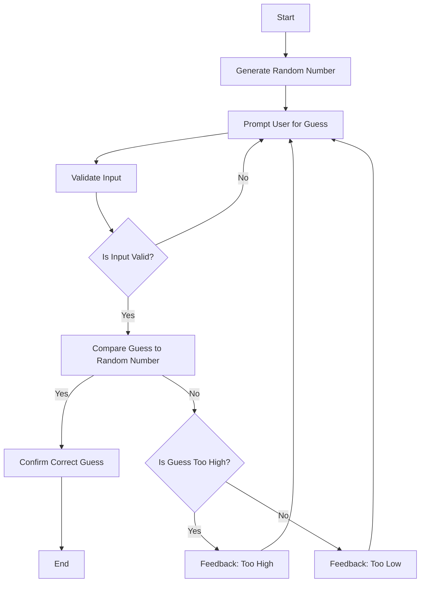

Upon starting, the program will generate a random number. It will then prompt the user for their guess. After input is recieved it will undergo validation. If valid the input will be compared to the generated number. The user will recieve feedback depending on if their answer is too high, too low, or correct.